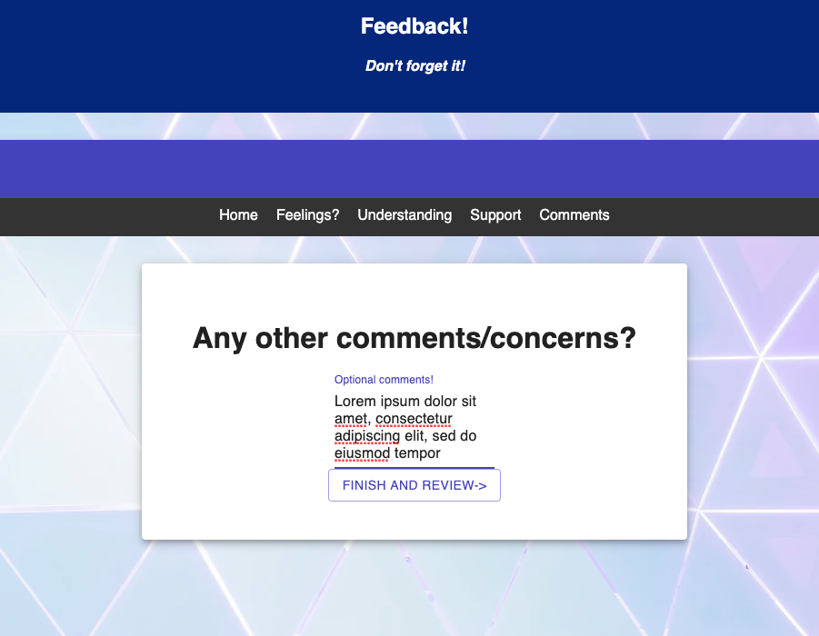
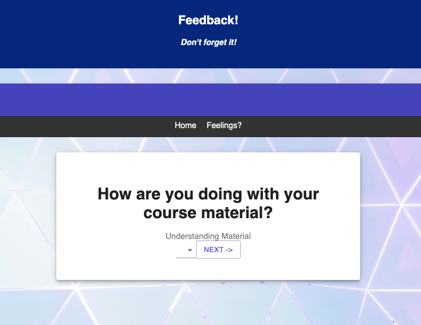
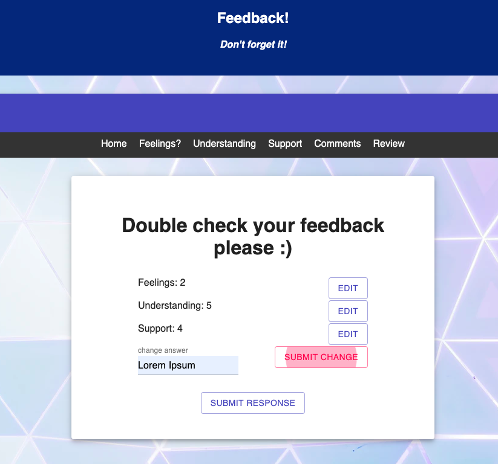

# Project Name

Feedback Survey!

## Screenshots

## PRE REQUISITES 

Node.js (https://nodejs.org/en/)
PostgreSQL(https://www.postgresql.org/)
Postico For easy DB interactions (https://eggerapps.at/postico/)

## Installation
-Create a database named: prime_feedback, 

-The queries in the data.sql file are set up to create all the necessary tables and populate the needed data to allow the application to run correctly. The project is built on Postgres, so you will need to make sure to have that installed. We recommend using Postico to run those queries as that was used to create the queries(as recommended above),

-Open up your editor of choice and run an npm install

-Run npm run server in your terminal
-Run npm run client in your terminal
-The npm run client command will open up a new browser tab for you!

## USAGE

I was asked to create a small survey that checked in on people to see how they were handling coursework/ how they were doing emotionally while enrolled in a program.
I ended up making an app that used routing technology to linearly move the user through the application page by page until they finished. All of this information is stored into a database with an administrator page to easily access the information to better help their students. Each page will give you instructions on how to move forward in this intuitively designed application.

## Technologies 
 React, jsx, redux, react-redux, react-router-dom, express, pg, pool, axios, and Material-ui. 

 ## Acknowledgement
I want to thank my instructors Casie, Kris, and Edan for providing me the tools to learn. Also big thanks to my classmates for being a source of motivation as we all strive to better ourselves by learning to code.